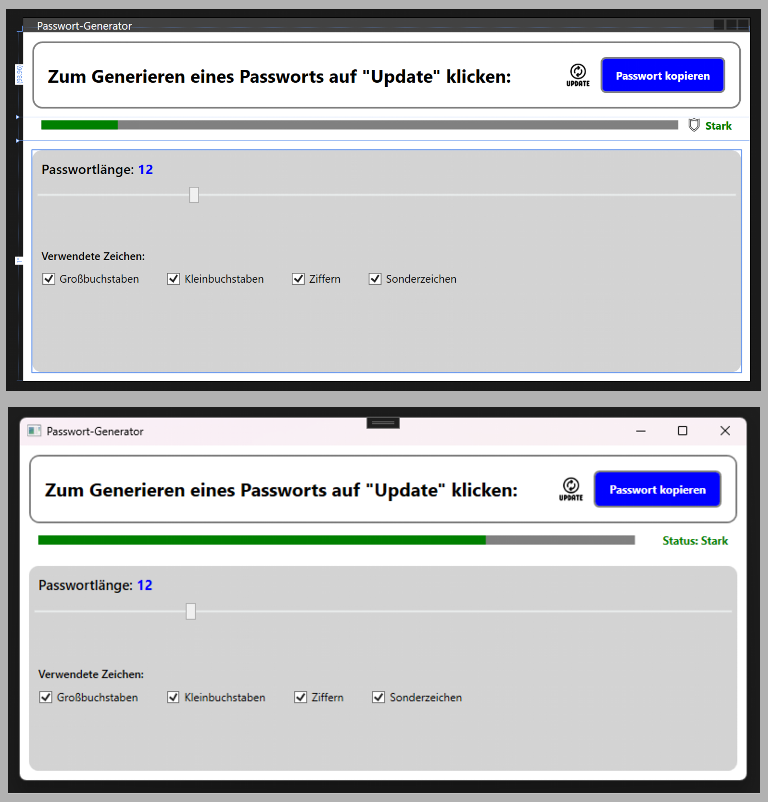
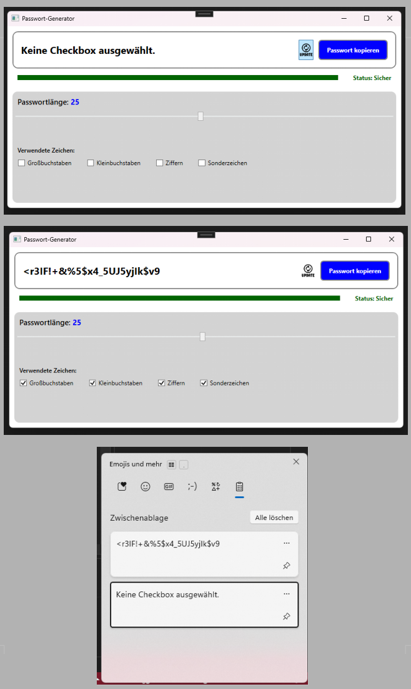

# passwort-generator
Ein Passwortgenerator als WPF-Desktop-App in C#.

Dieser Passwort-Generator ermöglicht es, sichere und individuell anpassbare Passwörter zu erstellen.  
Der Fokus liegt auf einfacher Bedienung, transparenter Sicherheitseinschätzung und flexiblen Einstellungsmöglichkeiten.

---

## ✨ Funktionen

- 🔢 **Individuelle Passwortlänge**  
  Die Länge des Passworts kann über einen Schieberegler festgelegt werden.

- 📊 **Live-Sicherheitsanzeige**  
  Während der Regler bewegt wird, wird in Echtzeit angezeigt, wie sicher das aktuelle Passwort ist.  
  Ein **Farbbalken passt sich dynamisch an** und ändert seine Farbe je nach Passwortlänge und -stärke.

- ✅ **Auswahl der Zeichentypen per Checkbox**  
  Der Benutzer kann selbst entscheiden, welche Zeichen im Passwort enthalten sein sollen:
  - Großbuchstaben (A–Z)
  - Kleinbuchstaben (a–z)
  - Ziffern (0–9)
  - Sonderzeichen (z. B. !, ?, %, #)

- ⚙️ **Dynamische Passwort-Generierung**  
  Das Passwort wird automatisch neu generiert, sobald sich Einstellungen ändern.

- 📋 **Kopier-Button**  
  Über einen Button kann das generierte Passwort **direkt in die Zwischenablage kopiert** werden, um es schnell und bequem weiterzuverwenden.

---

## 🎯 Ziel des Projekts

Ziel dieses Projekts ist es, einen einfachen, übersichtlichen und sicheren Passwort-Generator zu entwickeln,  
der dem Benutzer volle Kontrolle über die Passwort-Erstellung gibt und gleichzeitig eine verständliche visuelle Einschätzung der Passwortstärke bietet.

---

  

  

